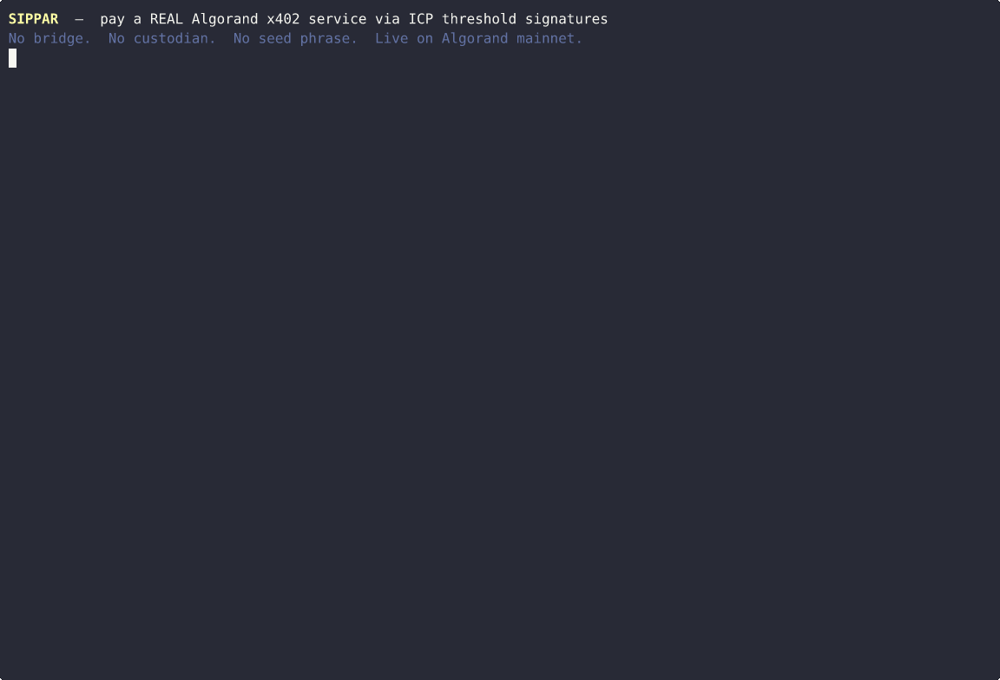

# Sippar — Algorand x402 (Agentic Commerce Hackathon, Berlin 2026)

**Sippar lets an AI agent on any chain pay for Algorand x402 services via ICP threshold signatures — no bridge, no custodian, no seed phrase.**

This is the public hackathon repository for Sippar's Algorand x402 work. It contains the open-source ElizaOS plugin, the submission write-up, ecosystem research, and reference excerpts of the backend that pays Algorand x402 services with ICP threshold signatures. (Sippar's full production backend is private.)

---

## Demo



*Full video: [`docs/sippar-algorand-demo.mp4`](docs/sippar-algorand-demo.mp4) — Sippar threshold-signs an Algorand x402 payment to a real third-party service (Carbon & Cashmere) and returns a live result, settled on-chain.*

---

## Proven on Algorand mainnet (verifiable on-chain)

| What | Transaction |
|------|-------------|
| Threshold-signed payment to a **real third-party Algorand x402 service** (Carbon & Cashmere forensics API) — returned a live result | [`RKGSX6MBEBWIEKYFUCQIISARV2O5RTAJY46H4E4YIV2JS6WH4EAA`](https://allo.info/tx/RKGSX6MBEBWIEKYFUCQIISARV2O5RTAJY46H4E4YIV2JS6WH4EAA) |
| Threshold-signed payment to Sippar's own AI-inference endpoint (Featherless) | [`35EJIH6ME544QAPGKWN4INABHL52T47UOCOOXIS3JJNQRLFR2NDA`](https://allo.info/tx/35EJIH6ME544QAPGKWN4INABHL52T47UOCOOXIS3JJNQRLFR2NDA) |
| **Quantoz EURQ** opt-in (settlement reserve ready to receive EURQ) | [`KGL55F3IROJQNEERP5LFC6D6A7IJQG3KQZ2INELHQOJ7QI74Q2QA`](https://allo.info/tx/KGL55F3IROJQNEERP5LFC6D6A7IJQG3KQZ2INELHQOJ7QI74Q2QA) |

All settle on Algorand mainnet (CAIP-2 `algorand:wGHE2Pwdvd7S12BL5FaOP20EGYesN73ktiC1qzkkit8=`) via the GoPlausible facilitator, signed by an ICP distributed key — no single private key exists.

---

## The problem

An AI agent can only pay for a service on the chain where it already holds funds. Nobody can pay an Algorand x402 service without first holding Algorand assets — a hard wall for cross-chain agent commerce. Sippar removes the wall: an agent pays on whatever chain it holds funds, and Sippar settles the service-side payment **natively on Algorand** via x402, signing the Algorand transaction directly with ICP threshold signatures.

## What's in this repo

- **`packages/plugin-x402-algorand/`** — open-source ElizaOS plugin / pure-TS library for x402 payments on Algorand. Automatic 402 handling, multi-stablecoin allowlist (USDC + Quantoz EURQ/USDQ), SSRF protection. MIT.
- **`backend-reference/`** — excerpts of Sippar's (private) backend that do the threshold-signed Algorand x402 payments: the threshold client, the Featherless x402 wrapper, the x402-native middleware (USDC + EURQ), and the route handlers. *Reference only — not standalone (they import internal Sippar services).*
- **`docs/hackathon/`** — the submission write-up + a survey of the live Algorand x402 service landscape.

## Quick start (the plugin)

```ts
import { createSigner, createX402Fetch } from '@sippar/plugin-x402-algorand';

const signer = createSigner(process.env.ALGORAND_PRIVATE_KEY!);
const x402Fetch = createX402Fetch(signer, {
  facilitatorUrl: 'https://facilitator.goplausible.xyz',
  allowedDomains: ['your-service.com'],
  usdcAssetId: 31566704,
  allowedAssetIds: [2768422954], // Quantoz EURQ
});

const res = await x402Fetch('https://your-service.com/paid-endpoint');
```

## Stablecoins (verified Algorand mainnet ASAs)

| Asset | ASA ID |
|-------|--------|
| USDC | `31566704` |
| Quantoz EURQ | `2768422954` |
| Quantoz USDQ | `2768603795` |

## Links

- Live: https://sippar.network
- GoPlausible facilitator: https://facilitator.goplausible.xyz
- Algorand x402: https://algorand.co/agentic-commerce/x402

## License

MIT (see [LICENSE](LICENSE)). Backend-reference excerpts are shared for hackathon review.

## Discover more Sippar services

This is one integration. The full Sippar catalog of payable x402 services across many chains (with prices and usage) is discoverable here:

- Machine-readable: <https://sippar.network/llms.txt> and <https://sippar.network/api/sippar/marketplace>
- Web: <https://sippar.network/marketplace>
- For AI agents (MCP): <https://sippar.network/mcp> (call `discover_services`, then `pay`)

Sippar settles x402/MPP payments from one threshold-derived wallet and returns an on-chain receipt per payment.
